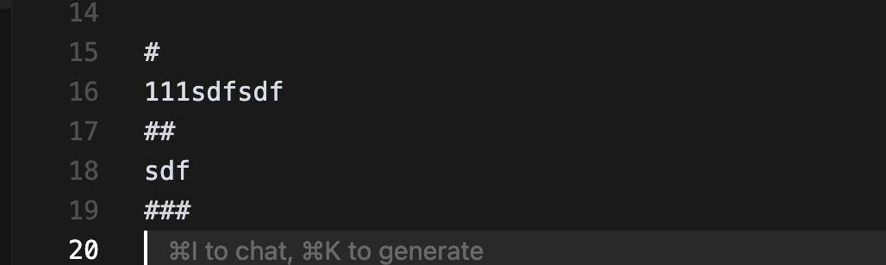
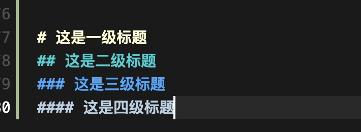
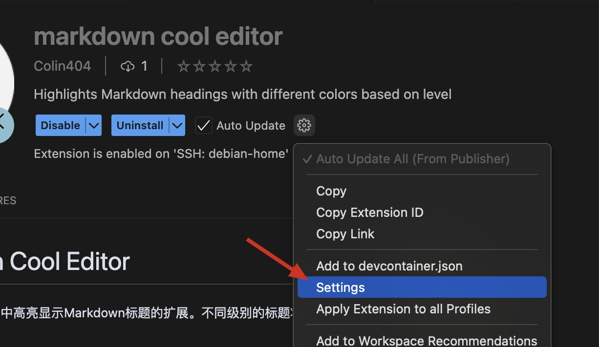

# Markdown Cool Editor

一个用于在VSCode中高亮显示Markdown标题的扩展。不同级别的标题将使用不同的颜色进行显示。

原始效果

使用后的效果

## 默认颜色
# 
- H1 (`# 标题`) - 奶油色 (#FFFDD0)
- H2 (`## 标题`) - 深青色 (#00CED1)
- H3 (`### 标题`) - 浅蓝色 (#33A8FF)
- H4 (`#### 标题`) - 粉蓝色 (#B6D0E2)

## 自定义颜色

您可以在VSCode设置中自定义每个级别标题的颜色：

## 安装

打开插件市场，搜索"Markdown Cool Editor"，点击安装。