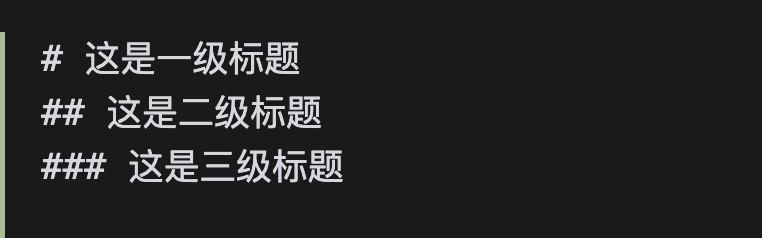

# Markdown Heading Highlignt

一个用于在VSCode中高亮显示Markdown标题的扩展。不同级别的标题将使用不同的颜色进行显示。

An extension for highlighting Markdown headings in VSCode. Titles of different levels will be displayed in different colors.

原始效果  Original 

使用后的效果 After use

## 默认颜色 Default

- H1 (`# 标题`) - (#79E7A8)
- H2 (`## 标题`) -  (#00CED1)
- H3 (`### 标题`) -  (#33A8FF)
- H4 (`#### 标题`) -  (#B6D0E2)

## 自定义颜色 Custom color

您可以在VSCode设置中自定义每个级别标题的颜色：

## 安装 install

打开插件市场，搜索"Markdown Heading Highlight"，点击安装。

Open the plugin market, search for "Markdown Heading Highlight", and click to install.

# 这是一级标题
## 这是二级标题
### 这是三级标题

